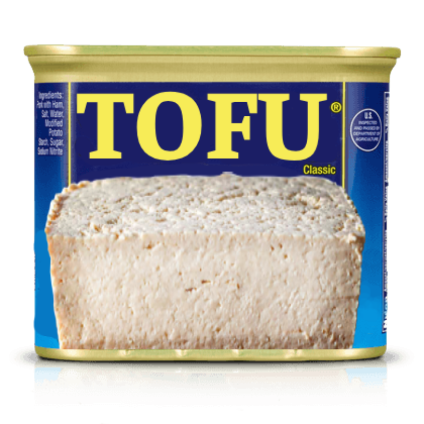

# Introducing: Tofu Toggle! 

Tofu toggle is the new and improved way to enjoy our website. Now accessible for anyone who doesn't eat pork or meat in general! 

## How does it work? 
Tofu toggle makes use of `useContext` from React. `useContext` sets up a boolean global state in `client/ProteinContext.tsx`, which is then toggled via the `ToggleButton` component in the `UI` folder. This global state can then be accessed in any of our front end components, hooks, and api functions. 

## Changes to our frontend functionality 
For now, only three aspects of the frontend have been changed: 

- `Header.tsx`: This now conditionally renders the spam or tofu image depending on the global state. 
- `apiClient.ts`: The names of our `getAllSpams` and `getSpamById` api functions have been changed to `getAllProteins` and `getProteinById` respectively. The global state is passed to each of these functions as an additional argument, which then determines whether the spams or tofu endpoints are consumed from the server. Thus, different data is served to the frontend depending on the toggled state. 
- `hooks`: The `useSpams` hook has been changed to `useProteins`. There is some additional logic inside the hook now to pass in the global state to the api functions. 

## What still needs to be done? 
Before this can become an official feature in main, there's more work left to do: 

- Update the games styling to look like tofu, upon global state change 
- Add in ratings and comments data for the tofu - currently the spam ones just appear on both 
- Add in new data for the quiz, so that a tofu themed quiz appears upon global state change
- Add in new data for the about page, so that it is about tofu upon global state change 

There's probably other stuff I've missed too, so please feel free to edit this doc to add in more updates. 